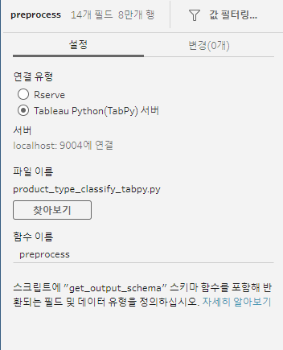

# script - python, R serve

### 라이브러리 설치

파이썬

```python
pip install tabpy
pip install tabpy_client
```

R

```jsx
install.packages("Rserve")
```

데이스탑에서 실시간 연산에 사용하거나 전처리 과정(prep) 흐름에 추가 가능

### prep 사용

- 사용 조건
    - prep 흐름 사용 전 라이브러리를 실행한 상태
        - power shell 등 터미널에서 “tabpy” 실행
        - R studio에서 “library(Rserve)”, “Rserve()” 실행
    - 터미널이 켜져있어야 함
    - localhost 구동 or 서버 구동
        - 파이썬 로컬호스트 포트 9004
        - R 로컬호스트 포트 6311
    - script 안에 하나의 데이터 프레임만 처리할 수 있어서 다른 데이터 프레임이 필요하면 prep에서 연결 후 다시 script를 생성하여 연결해야 함.
- 스크립트 작성 조건
    - 라이브러리 로드
    - 데이터 프레임을 처리하는 펑션
    - 데이터 프레임 컬럼 형식 지정하는 펑션
        - prep_string() 문자열
        - prep_decimal() 실수
        - prep_int() 정수
        - prep_bool() 부울
        - prep_date() 날짜
        - prep_datetime() 날짜/시간

`예시` 파이썬

```python
#라이브러리 로드
import numpy as np
import pandas as pd

#데이터 프레임을 처리하는 펑션
def preprocess(df):                    # "preprocess" 이 값을 prep에 입력
		...
		df = df
		...
    return output

#데이터 프레임 컬럼 형식 지정하는 펑션
def get_output_schema():       
  return pd.DataFrame({
    'mallid_pid' : prep_string(),
    'id' : prep_string(),
    'brand_code' : prep_string(),
    'product_id' : prep_string()
})
```

`예시` R

```python
#라이브러리 로드
library(tidyverse)

#데이터 프레임을 처리하는 펑션
image <- function(df) {                   # "image" 이 값을 prep에 입력
	...
  df
	...
  return(data.frame(df))
}

#데이터 프레임 컬럼 형식 지정하는 펑션
getOutputSchema <- function() {      
  return (data.frame (
    id     = prep_string(),
    code  = prep_string(),
    zone_id  = prep_string(),
    brand_code = prep_string(),
    review_id  = prep_int()
    ));
}
```

df는 흐름에서 연결하는 전 노드의 출력 데이터프레임

map이나 apply 연산이 잘 작동되지 않음

온전한 데이터 프레임 형태 연산이 오류가 없음(리스트 등의 변형의 연산과정이 있으면 오류 발생)

- prep 설정 > script 노드 추가, 저장한 파일 선택 후 함수 선택



### Desktop 사용

- 태블로  데스트탑 설정
    
    
    
    
    
- 활용 방안 :
    - 태블로 데스크탑에서 측정값에서 사용
        
        ```python
        # 예시 코드
        import tabpy_client
        from tabpy.tabpy_tools.client import Client
        client = Client('http://localhost:9004/')
        
        # 펑션 생성
        def addFunction(x,y):
            import numpy as np
            return np.add(x, y).tolist()
        # 평션 디플로이 > 로컬호스트 서버에 저장
        client.deploy('addFunction', addFunction, 'x+y')
        # 펑션 삭제
        client.remove('addFunction')
        ```
        
        웹에서 확인 > https://localhost:9004
        
        
        
        ```python
        # 태블로 대스크탑에서 측정값 작성
        SCRIPT_REAL("
        return tabpy.query('addFunction',_arg1,_arg2)['response']",
        [매개변수1],[매개변수2]
        )
        ```
        
        참고
        
        [Tabpy - Table Extension으로 태블로에 파이썬 스크립트 바로 호출하기 - TABLEAU WIKI](https://tableauwiki.com/tableau-tabpy-script-using-table-extension/)
        
        - **tabpy 비번 설정**
        
        [](https://github.com/tableau/TabPy/blob/master/docs/server-config.md)
        
        `tabpy` 터미널 실행 후 메세지 확인하면 default.conf 파일 경로 확인가능 함
        
        ~/tabpy/~/common/
        
        해당 경로에 password.txt 파일 생성
        
        생성 후 해당 코드 실행
        
        `tabpy-user add -u <username> -p <password> -f <pwdfile>`
        
        경로의 default.conf 파일 열어서 수정
        
        ```python
        [TabPy]
        # TABPY_QUERY_OBJECT_PATH = /tmp/query_objects
        # TABPY_PORT = 9004
        # TABPY_STATE_PATH = <package-path>/tabpy/tabpy_server
        
        # Where static pages live
        # TABPY_STATIC_PATH = <package-path>/tabpy/tabpy_server/static
        
        # For how to configure TabPy authentication read
        # docs/server-config.md.
        TABPY_PWD_FILE = /path/to/password/file.txt
        
        # To set up secure TabPy uncomment and modify the following lines.
        # Note only PEM-encoded x509 certificates are supported.
        # TABPY_TRANSFER_PROTOCOL = https
        # TABPY_CERTIFICATE_FILE = /path/to/certificate/file.crt
        # TABPY_KEY_FILE = /path/to/key/file.key
        
        # Log additional request details including caller IP, full URL, client
        # end user info if provided.
        # TABPY_LOG_DETAILS = true
        
        # Limit request size (in Mb) - any request which size exceeds
        # specified amount will be rejected by TabPy.
        # Default value is 100 Mb.
        # TABPY_MAX_REQUEST_SIZE_MB = 100
        
        # Enable evaluate api to execute ad-hoc Python scripts
        # Enabled by default. Disabling it will result in 404 error.
        # TABPY_EVALUATE_ENABLE = true
        
        # Configure how long a custom script provided to the /evaluate method
        # will run before throwing a TimeoutError.
        # The value should be a float representing the timeout time in seconds.
        # TABPY_EVALUATE_TIMEOUT = 30
        
        # Configure TabPy to support streaming data via Arrow Flight.
        # This will cause an Arrow Flight server start up. The Arrow
        # Flight port defaults to 13622 if not set here.
        # TABPY_ARROW_ENABLE = True
        # TABPY_ARROWFLIGHT_PORT = 13622
        
        [loggers]
        keys=root
        
        [handlers]
        keys=rootHandler,rotatingFileHandler
        
        [formatters]
        keys=rootFormatter
        
        [logger_root]
        level=DEBUG
        handlers=rootHandler,rotatingFileHandler
        qualname=root
        propagete=0
        
        [handler_rootHandler]
        class=StreamHandler
        level=DEBUG
        formatter=rootFormatter
        args=(sys.stdout,)
        
        [handler_rotatingFileHandler]
        class=handlers.RotatingFileHandler
        level=DEBUG
        formatter=rootFormatter
        args=('tabpy_log.log', 'a', 1000000, 5)
        
        [formatter_rootFormatter]
        format=%(asctime)s [%(levelname)s] (%(filename)s:%(module)s:%(lineno)d): %(message)s
        datefmt=%Y-%m-%d,%H:%M:%S
        ```
        
        저장 후 실행
        
        `tabpy --config={경로}/default.conf`
        
        대시보드에서 분석프로그램 설정 시 ip port 비번 패스워드 입력
        
        - **tabpy를 클라우드에서 사용 시 로컬 호스트는 작동 안됨**
        
        클라우드 인스턴스 생성, public IP 생성 > ip , port9004  대시보드에 저장
        
        참고
        
        [https://youtu.be/Zm4hr3hc318?si=eBuc3lwwswGoq2oV](https://youtu.be/Zm4hr3hc318?si=eBuc3lwwswGoq2oV)
        
        ### TSM 설치
        
        데스크탑이나 회사 서버를 태블로 서버로 만들기 위해서는 TSM설치가 필요함
        
        [https://help.tableau.com/current/server/ko-kr/setup.htm](https://help.tableau.com/current/server/ko-kr/setup.htm)